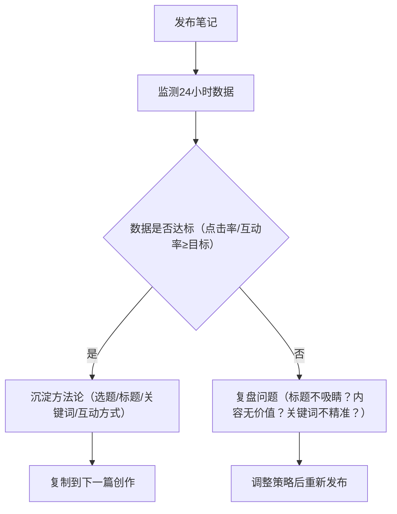

# 2025小红书内容创作&流量增长方法论指南
## 一、核心原则（底层逻辑）
算法的本质是「连接优质内容与目标用户的桥梁」，而非障碍。创作核心逻辑：**用户价值优先+科学运营辅助**，拒绝钻算法漏洞，聚焦内容质量与精准运营的正向循环。

## 二、前期准备：账号定位与养号破池
### 1. 账号定位（决定赛道天花板）
#### （1）高增长赛道选择（2025 Q4重点）
- 银发经济（中老年生活/好物）
- AI生产力工具测评（效率软件/AI应用）
- 沉浸式虚拟空间体验（元宇宙/虚拟场景）

#### （2）人设打造公式
`专业背书（XX认证/从业经验）+ 情绪价值（解决特定焦虑：如通勤穿搭焦虑、护肤踩坑焦虑）+ 差异化记忆点（如“抠门党测评”“小个子专属”）`

#### （3）养号操作（注册后72小时）
- 设备要求：使用独立设备，避免多账号登录
- 行为要求：深度浏览对标账号（点赞+收藏+评论高赞笔记），模拟真实用户行为
- 禁忌：不发布违规内容、不频繁修改资料、不批量点赞/评论

### 2. 破流量池技巧（冷启动关键）
- 前3篇笔记必加官方标签：`#新人来报道`，可额外获得500基础曝光
- 内容方向：聚焦定位赛道，发布纯干货内容（避免硬广、无关话题）
- 互动铺垫：提前准备3-5个亲友/社群种子用户，用于后续黄金2小时互动

## 三、内容创作：从选题到成品的全流程优化
### 1. 选题逻辑（高流量前提）
- 核心标准：满足「实用价值（解决具体问题）+ 情感共鸣（场景化叙事）+ 不可替代性（实测/对比/独家信息）」
- 选题方法：搜索领域主关键词，筛选近30天高赞（1万+）笔记，拆解其核心痛点/解决方案，进行差异化迭代（如别人做“防晒测评”，你做“油皮夏季防晒测评+紫外线实测数据”）

### 2. 标题创作（点击率核心）
#### （1）标题公式
- 痛点式：`问题+解决方案`（如“油皮夏天控油难？3款精华实测不脱妆”）
- 排列式：`合集/清单类`（如“2025小个子通勤穿搭｜5套显瘦不踩雷”）

#### （2）关键词要求
- 前10字必须嵌入「主关键词」（如“护肤”“露营”“职场”）
- 优先使用「场景词+长尾词」组合（如“2025上班族早餐食谱｜10分钟搞定营养餐”）

#### （3）爆款标题模板
1. 「痛点」+「数字」+「解决方案」：敏感肌泛红？3个急救方法2天退红
2. 「场景」+「人群」+「核心价值」：租房党小厨房改造｜500元搞定收纳+颜值
3. 「否定误区」+「正确做法」：别再乱买防晒霜！油皮必看的3个选购标准

### 3. 正文创作（留存+互动关键）
#### （1）四维质量模型
| 维度         | 具体要求                                                                 |
|--------------|--------------------------------------------------------------------------|
| 信息密度     | 每100字包含1个实用知识点（如“粉底液选色技巧：黄皮选暖调二白，避免发灰”） |
| 情感共鸣     | 用场景化描述引发共情（如“加班到深夜，用这支平价面霜急救，第二天皮肤不垮脸”） |
| 视觉美感     | 段落分明（每3-5行分段），重点内容用表情符号/加粗突出，搭配高清实拍图（4-6张） |
| 行动引导     | 设计互动钩子：“收藏解锁隐藏用法”“评论区扣1领详细模板”“你们还有什么疑问？评论区见” |

#### （2）关键词布局（三级矩阵）
| 关键词类型 | 作用                  | 布局位置                          | 示例                          |
|------------|-----------------------|-----------------------------------|-------------------------------|
| 主关键词   | 锁定核心流量          | 标题首段、正文开头200字内         | 护肤、露营、穿搭              |
| 长尾关键词 | 高转化、低竞争        | 正文中段、图片alt文本             | 油皮夏季控油精华、新手露营装备 |
| 场景关键词 | 精准触达目标人群      | 标题、正文分段开头                | 2025上班族通勤穿搭、宝妈带娃好物 |

- 实操要求：正文前200字自然融入2-3个关键词，避免堆砌

### 4. 封面与标签优化
#### （1）封面设计（点击率提升27%技巧）
- 配色：高饱和度色块（红+黄、蓝+白）
- 元素：文字标题（简洁明了，突出核心价值）+ 高清实拍图（主体突出，无杂乱背景）
- 禁忌：避免水印、模糊图、违规元素（如敏感标识、硬广logo）

#### （2）标签组合策略（共6-10个）
| 标签类型 | 数量 | 要求                          | 示例                          |
|----------|------|-------------------------------|-------------------------------|
| 核心标签 | 2-3个 | 行业大词，覆盖核心流量        | #美妆 #露营 #职场              |
| 长尾标签 | 3-5个 | 具体场景/人群，精准转化        | #混油皮粉底液 #小户型收纳 #中考逆袭 |
| 热点标签 | 1-2个 | 当下热门话题，蹭额外流量        | #夏日降温神器 #AI工具推荐      |

## 四、发布与运营：撬动流量池晋级
### 1. 黄金2小时运营（流量加权关键）
- 时间窗口：笔记发布后的2小时内（平台加权计算互动数据）
- 操作步骤：
  1. 分享笔记到亲友群、粉丝社群，引导「点赞+收藏+评论（≥5字）+转发」
  2. 主动回复评论区所有留言（尤其是提问类评论），提升评论互动率
  3. 引导用户关注账号（如“关注我，下期分享更多干货”）

### 2. 发布时间选择（参考）
- 按赛道调整：
  - 职场/学习类：早8点（通勤）、晚8-10点（下班后）
  - 母婴/家庭类：上午10点（带娃间隙）、晚7-9点（睡前）
  - 美妆/穿搭类：午12点（午休）、晚8-11点（休闲时间）

### 3. 互动优化技巧（提升CES评分）
- CES评分公式：`CES = 点赞×1 + 收藏×1 + 评论×4 + 转发×4 + 关注×8`
- 重点动作：
  1. 引导长评论（>50字）：“你们用这款产品遇到过什么问题？详细说说，我来解答”
  2. 引导收藏至专辑：“收藏到你的「护肤干货」专辑，下次找不迷路”
  3. 引导转发：“转发给需要的朋友，一起避坑”

## 五、数据复盘：持续优化迭代
### 1. 核心数据监测（创作中心查看）
| 数据指标       | 关注重点                          | 优化方向                          |
|----------------|-----------------------------------|-----------------------------------|
| 点击率（CTR）  | 标题+封面吸引力（目标≥3%）        | 优化标题关键词、封面配色/文字     |
| 互动率（赞藏评）| CES评分核心（目标≥5%）            | 增加互动钩子、优化内容价值        |
| 搜索流量占比   | 关键词布局效果（目标≥10%）        | 补充高热搜长尾词                  |
| 粉丝增长数     | 人设吸引力+内容垂直度             | 强化差异化记忆点、聚焦赛道内容    |

### 2. 策略迭代闭环

1. 权重提升核心动作
影响因素	具体要求
账号活跃度	每周发布 2-3 篇高质量笔记，避免断更超过 7 天
内容合规性	不发布敏感词、硬广、外链、违规图片，参考平台《社区公约》
粉丝互动率	近 7 日互动率（赞藏评 / 曝光）高于行业均值 60%，权重提升 30%
内容垂直度	聚焦 1 个核心赛道，跨类目发文（如美妆号发美食）权重下降 50%
2. 限流解除操作流程
数据检测：通过创作中心查看笔记阅读量，若较之前下降 50% 以上，判定为限流
内容清理：删除近 30 天内可能违规的笔记（含硬广、外链、敏感词的内容）
申诉准备：整理申诉材料（产品授权书、内容原创证明等 PDF 文件），通过官方渠道申诉
观察期运营：每日发布 1-2 篇纯干货笔记（无营销信息），持续 7 天
结果验证：76% 账号可在 7 个工作日内解除限流，若未恢复则重复上述步骤
七、变现路径指南（粉丝积累后）
变现方式	门槛	收益参考	操作要点
广告合作	1 万粉丝以上	单条报价 8000 元 +	保持内容垂直度，与品牌调性匹配
知识付费	5000 粉丝以上（精准粉）	私域转化率 12%，年度会员 1999 元	输出独家干货，搭建私域社群
直播带货	1 万粉丝以上 + 直播权限	单场 GMV 突破 80 万	选品贴合赛道，直播中强化互动转化
八、实用工具包（辅助创作）
关键词工具：小红书搜索下拉词、5118 小红书关键词库（查长尾词搜索量）
敏感词检测：零克查词、句易网（避免违规）
封面设计：醒图、Canva 可画（高饱和模板）
数据监测：小红书创作中心、新红数据（对标账号分析）
使用说明
本指南可直接下载为 markdown 文件，创作前快速查阅对应模块（如写标题时看 “标题创作” 部分，发布后看 “黄金 2 小时运营”）；
每完成 1 篇笔记，对照 “数据复盘” 模块记录优化点，逐步形成个人专属创作方法论；
定期关注小红书平台算法更新（如 2025 年用户价值评估模型），及时调整运营策略；
若遇到具体问题（如限流申诉、关键词布局），可参考对应模块操作，或咨询平台官方 / 专业运营人士。
plaintext

### 下载操作步骤（以Windows系统为例）：
1. 打开「记事本」（或VS Code、Typora等编辑器）；
2. 复制上面全部代码（从 `# 2025小红书内容创作&流量增长方法论指南` 到最后）；
3. 粘贴到记事本中，点击左上角「文件」→「另存为」；
4. 文件名输入：`2025小红书创作方法论指南.md`（后缀必须为 `.md`）；
5. 保存类型选择「所有文件」，编码选择「UTF-8」；
6. 选择保存路径（如桌面），点击「保存」即可。

后续可通过 Typora、VS Code、浏览器（直接打开）等工具打开查看，方便创作时随时查阅~